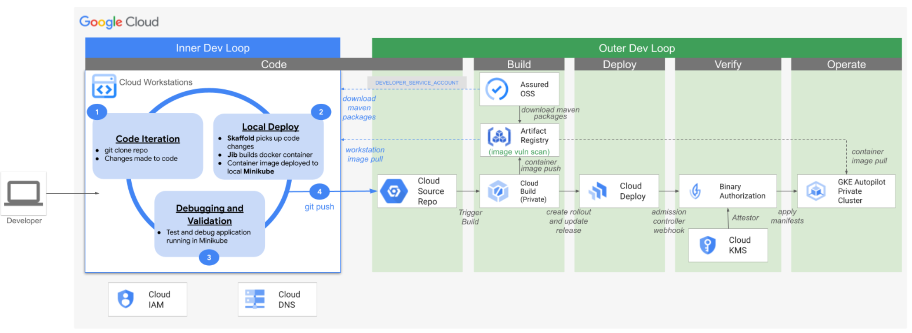
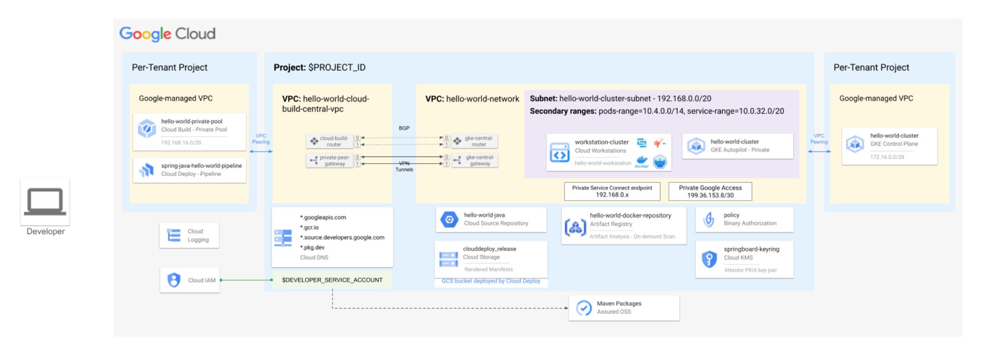

# Secure DevOps Architecture - Inner/Outer App Lifecycle

This code creates a demo environment for Secure DevOps Architecture Pattern
This demo code is not built for production workload


# Demo Guide
This demo uses Terraform to setup the Secure DevOps Architecture in a single folder and single project. The underlying infrastructure uses Google Cloud services like  
[Artifact Registry](https://cloud.google.com/artifact-registry), [Assured Open Source Software](https://cloud.google.com/assured-open-source-software), [Binary Authorization](https://cloud.google.com/binary-authorization), [Cloud Build](https://cloud.google.com/build), [Cloud Deploy](https://cloud.google.com/deploy), 
[Cloud Key Management](https://cloud.google.com/kms), [Compute Engine](https://cloud.google.com/compute), [GKE](https://cloud.google.com/containers), [Datastore](https://cloud.google.com/datastore), [Cloud DNS](https://cloud.google.com/dns), [Cloud Logging](https://cloud.google.com/logging), [Storage](https://cloud.google.com/storage) and [Cloud Workstations](https://cloud.google.com/workstations). 

## How to deploy?
The following steps should be executed in Cloud Shell in the Google Cloud Console. Ensure no project is set in cloud shell. To unset a project use the command below.

```
gcloud config unset project
```

### 1. IAM Permission 
Grant the user running the Terraform below roles.
```
TO BE UPDATED
Billing Account User
Organization Policy Administrator
Folder Creator
Project Creator
DNS Administrator
```


### 2. Get the code
Clone the GitHub repository and navigate to the root of the repository.

``` 
git clone https://github.com/GCP-Architecture-Guides/CSA-App-Dev.git
cd CSA-App-Dev
```

### 3. Deploy the infrastructure using Terraform


From the root folder of this repo, run the following commands:

```
export TF_VAR_organization_id=[YOUR_ORGANIZATION_ID]
export TF_VAR_billing_account=[YOUR_BILLING_ID]
export TF_VAR_end_user_account=["user:USERNAME@DOMAIN.com"]
terraform init
terraform apply
terraform apply --refresh-only
```

To find your organization id, run the following command: 
```
gcloud projects get-ancestors [ANY_PROJECT_ID]
```

**Note:** All the other variables are given a default value. If you wish to change, update the corresponding variables in the variable.tf file.

### 4: Use Your Secure Development Environment

1. Open the Google Cloud Console through a web browser and navigate to the [Cloud Workstations page](https://console.cloud.google.com/workstations/list)
2. Navigate to you Cloud Workstation (named 'hello-world-worksation' be default) and click the 'Launch' button. Note: If you see the 'Start' button instead of 'Launch', click the 'Start' button and then click the 'Launch' button once it becomes available.
    * 

4. You should now be in a new browser tab viewing your 'Code OSS' IDE.
    * 

5. Click the menu 'File -> Open Folder -> hello_word_java' to open your Java Sample Application project directory
    * 

7. Click the menu 'Terminal -> New Terminal'
    * 

8. You should see messages about Maven installation, Minikube starting, and Skaffold starting
10. Authorize your end-user account to the Workstation 'gcloud' cli in the terminal: `gcloud auth login`, and follow the steps to sign in.
11. Verify that the sample application is running and responding to requests
    * View the Skaffold logs and ensure that the service is running: `tail -f /var/log/skaffold.log` 
    * You should see a similar message towards the end of the logs: "Started HelloWorldApplication in 3.195 seconds"
    * Send a request to the Java application from the Cloud Workstation terminal to the Minikube cluster: `curl http://localhost:9000`. 
    * NOTE: Skaffold is configured to forward port 9000 to your local Minikube k8s service. You may also click the hyperlink generated in your Cloud Workstation terminal from the 'http://localhost:9000' and view the application response in your web browser.
12. Make a code change, commit, and push to the remote repository
    * Open 'src/main/java/com/example/helloWorld/HelloWorldApplication.java' in your Cloud Workstation IDE and change the "Hello World" string to something different.
13. Commit and push your changes to the remote repository: `git add src && git commit -m "first custom commit" && git push`.
    * Note: Your repository is configured to use your 'gcloud' credentials to authenticate with the remote Cloud Source Repository. If there is an authentication problem, you may have forgotten to run `gcloud auth login` as described above.
14. Navigate to Cloud Build and verify that your 'Outer Dev Loop' build pipeline has completed successfully.
    * 
  * NOTE: There will be a total of 4 Builds that need to be successful: 1 that is declared in your Cloud Build Trigger (cloudbuild-launcher.yaml), 1 that is submitted by Build that ran through Cloud Build Trigger (cloudbuild.yaml), 2 that are submitted automatically by Cloud Deploy for your new release (that call the skaffold 'render' and 'deploy' stages).
16. When the Cloud Build steps have completed successfully, validate that your application can receive requests from your Cloud Workstations.
    * Set your k8s configuration to reference your remote GKE Cluster: `gcloud container clusters get-credentials hello-world-cluster --region us-central1`
    * Open a tunnel via port-forwarding from your Cloud Workstation to your GKE Service: `kubectl port-forward services/spring-java-hello-world-service 9090:8080`
    * Send a request to the Java application from the Cloud Workstation terminal to the Minikube cluster: `curl http://localhost:9090`.  You may also click the hyperlink generated in your Cloud Workstation terminal from the 'http://localhost:9090' and view the application response in your web browser.
17. When finishing testing your remote cluster, set your local k8s configuration back to Minikube for further dev work: `kubectl config use-context minikube`

### 5. How to clean-up?

From the root folder of this repo, run the following command:
```
terraform destroy
```

### 6. Deployment Duration
- Configuration: X mins TO BE UPDATED
- Deployment: Y mins TO BE UPDATED


## Detailed Overview
This architecture enhances the inner and outer software development loops in Google Cloud Platform environments, while satisfying key security requirements. Automated with Terraform for minimal setup, it integrates key services like Skaffold, Jib, and Minikube within a Cloud Workstation, and services like Cloud Build, Cloud Deploy, and GKE, all under strict IAM policies and private networking. This solution streamlines development cycles and secure deployments, balancing rapid innovation with key security controls, and aligning with enterprise compliance standards.

### Application Development Process Flow Diagram


### Terraform Deployment Overview
The Terraform configuration for this solution facilitates the automated creation and deployment of necessary resources within the Google Cloud Platform (GCP). This approach ensures consistency, repeatability, and a high level of customization for users, aligning with enterprise-grade infrastructure standards.

### Key Features of Terraform Implementation
1. Automated Resource Deployment: All resources required for the CSA - App Dev Arch Pattern are automatically created and deployed using Terraform.
2. Minimal User Input Required: Users are required to modify only three key variables in the variables.tf file, making the deployment process straightforward and user-friendly.
3. Customizable Variables: While certain variables are preset with recommended values, users retain the flexibility to alter these as needed to suit specific organizational requirements.
4. Organizational Structure Compliance: The deployment is structured to occur within a new folder under the organization's hierarchy in GCP, ensuring compliance with organizational policies and structure.

### Critical Variables in ‘variables.tf’
- organization_id: User must provide the unique identifier of their organization within GCP.
- billing_account: User must specify the billing account ID to associate with the deployed resources.
- end_user_account: Defines the list of allowed members who can make requests to the deployed resources.

Other variables, not listed here, are pre-configured but can be adjusted based on specific needs or preferences. These include settings related to network configurations, regions, and other resource-specific parameters.

### Deployment in New Organizational Folder
The Terraform script is designed to deploy resources within a new folder in the GCP organization. This approach:
- Ensures Organizational Neatness: Keeps the deployment isolated and organized within the broader Google Cloud environment.
- Facilitates Easier Management and Tracking: Enhances the ability to manage resources and monitor usage specific to this deployment.
- Aligns with Security and Compliance Standards: Adheres to organizational policies and governance structures.

## Infrastructure
The infrastructure for this solution aims to create a seamless DevOps pipeline for developers, employing a range of Google Cloud Platform (GCP) services for an integrated development experience. It is designed for Google Cloud customers who operate within an organizational structure that mandates enterprise security measures. This architecture is designed with the following in mind: 
- No internet access for resources
- Full compliance with commonly implemented organizational policies, including but not limited to constraints/compute.vmExternalIpAccess, constraints/compute.requireShieldedVm, and constraints/iam.disableServiceAccountKeyCreation. 
- Compatibility with Shared VPC models, facilitating separation of duties across various departments within your organization
- Compatibility with  VPC Service Controls to mitigate risks associated with sensitive data leakage and unauthorized access
- A least-privilege model through role-based IAM policies
- Short-lived credentials for service account authentication

It is recommended to coordinate with your organization's cloud security team during the deployment phase, particularly if specialized IAM permissions associated with the Compute Network Admin role are required, or if your organization has enabled the constraints/compute.restrictVpnPeerIPs Org policy.

### Secure DevOps Infrastructure Architecture Diagram


### What resources are created?
Components to be deployed:
- Project
    - One Google Cloud project will be created to contain all resources within this architecture.
- Region
    - By default, all resources are deployed within us-central1
-  Service Account
    - A service account will be created for access to the Assured OSS repository. This service account will be assigned project-level roles for access to each of the services and resources to be deployed and managed. These roles will be assigned using a least-privilege model.
    - Additionally, Cloud Deploy uses the default service compute service account for operations. This service account will be assigned additional roles to accommodate Cloud Build, Artifact Registry, Cloud Logging, and Cloud Storage operations, also using a least-privilege model.
- Cloud DNS
    - This solution enables Private Google Access to allow communication between Google Cloud services and resources within the project, without requiring internet access. Private Google Access requires DNS records to return IP addresses within the private.googleapis.com VIP for the desired Google service domains. These records will need to be created for the services included in this solution, including:
        - *.googleapis.com
        - *.gcr.io
        - *.source.developers.google.com
        -  *.pkg.dev
- VPC & Subnets
  This solution uses two VPCs.
    - VPC 1 (hello-world-network):
        - One primary subnet to host the Cloud Workstation instances and the GKE instances, with Private Google Access enabled.
        - Two secondary subnets for the GKE pods and services, respectively.
        - One Private Service Connect endpoint for Cloud Workstation communication to a Google-managed private gateway.
        - One VPC Peering to a Google-managed VPC, also called Service Networking, that contains the GKE control plane.
        - One HA VPN Gateway pair for connectivity to VPC 2. This includes two Cloud Routers to exchange routes between the VPCs via BGP.
        - Default firewall rules
    - VPC 2 (hello-world-cloud-build-central-vpc):
        - One VPC Peering to a Google-managed VPC, also called Service Networking, that contains the Cloud Build private pool.
        - One HA VPN Gateway pair for connectivity to VPC 1. This includes two Cloud Routers to exchange routes between the VPCs via BGP.

The Cloud Build private worker pool and the GKE control plane are placed in separate Google-managed VPCs that are peered to the customer's VPC.
This two-VPC design is necessary because the services cannot communicate directly with one another via a single customer VPC due to transitive peering restrictions.
  
- Cloud Workstation
    - One workstation cluster using the primary subnet in VPC 1
    - Private endpoint enabled, to ensure only private access to the workstations.
    - One workstation configuration with Shielded VMs enabled
    - Public IPs disabled to prevent workstations from obtaining external IP addresses.
    - One workstation created and launched by default.
- GKE Autopilot Cluster
    - Private cluster
    - Authorized networks enabled - allowing only the primary subnet from VPC 1
- Cloud Source Repository
    - One repository used to clone solution architecture resources, including source code.
- Artifact Registry
    - One Docker repository for storing image artifacts
- Cloud Build worker pool
    - One private worker pool deployed and peered with VPC 2
    - Worker pool configured with no public egress to keep all communications within the VPC
    - Configured to apply one manual attestation for Binary Authorization
- Binary Authorization
    - Enabled and with policy enforcement for the private GKE Autopilot Cluster
    - Two attestors to verify manual attestation and auto “built-by-Cloud-Build” provenance

The resources/services/activations/deletions that this module will create/trigger are:

- Create a GCS bucket with the provided name

### PreDeploy
To deploy this blueprint you must have an active billing account and billing permissions.

## Architecture

1. Architecture description step no. 1
2. Architecture description step no. 2
3. Architecture description step no. N

## Documentation

## Cost
[Blueprint cost details](https://cloud.google.com/products/calculator?id=02fb0c45-cc29-4567-8cc6-f72ac9024add)

## Usage

Basic usage of this module is as follows:

```hcl
module "simple_module" {
  source  = "terraform-google-modules/simple-module/google"
  version = "~> 0.1"

  project_id  = "<PROJECT ID>"
  bucket_name = "gcs-test-bucket"
}
```

Functional examples are included in the
[examples](./examples/) directory.

<!-- BEGINNING OF PRE-COMMIT-TERRAFORM DOCS HOOK -->
## Inputs

| Name | Description | Type | Default | Required |
|------|-------------|------|---------|:--------:|
| bucket\_name | The name of the bucket to create | `string` | n/a | yes |
| project\_id | The project ID to deploy to | `string` | n/a | yes |

## Outputs

| Name | Description |
|------|-------------|
| bucket\_name | Name of the bucket |

<!-- END OF PRE-COMMIT-TERRAFORM DOCS HOOK -->

## Requirements

These sections describe requirements for using this module.

### Software

The following dependencies must be available:

- [Terraform][terraform] v0.13
- [Terraform Provider for GCP][terraform-provider-gcp] plugin v3.0

### Service Account

A service account with the following roles must be used to provision
the resources of this module:

- Storage Admin: `roles/storage.admin`

The [Project Factory module][project-factory-module] and the
[IAM module][iam-module] may be used in combination to provision a
service account with the necessary roles applied.

### APIs

A project with the following APIs enabled must be used to host the
resources of this module:

- Google Cloud Storage JSON API: `storage-api.googleapis.com`

The [Project Factory module][project-factory-module] can be used to
provision a project with the necessary APIs enabled.

## Contributing

Refer to the [contribution guidelines](./CONTRIBUTING.md) for
information on contributing to this module.

[iam-module]: https://registry.terraform.io/modules/terraform-google-modules/iam/google
[project-factory-module]: https://registry.terraform.io/modules/terraform-google-modules/project-factory/google
[terraform-provider-gcp]: https://www.terraform.io/docs/providers/google/index.html
[terraform]: https://www.terraform.io/downloads.html

## Security Disclosures

Please see our [security disclosure process](./SECURITY.md).
